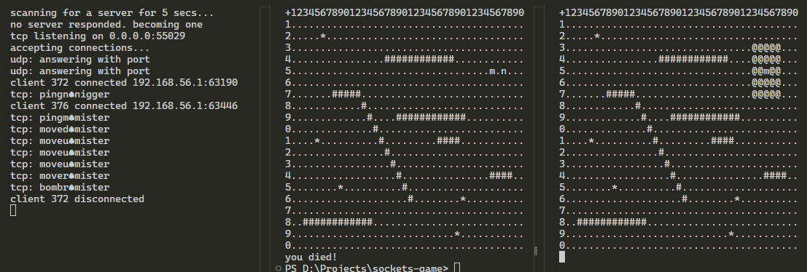
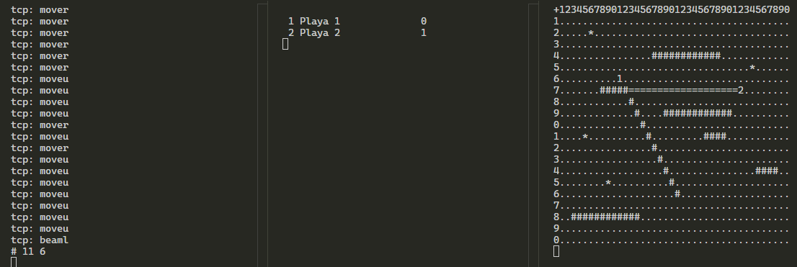

# Sockets Game

## Building

- Open a `.sln` file.
- Build in Visual Studio.
- Run multiple instances of the program.

You can also build it in VS Code. Just open the VS Code instance from within Developer Powershell that comes installed with regular VS.
