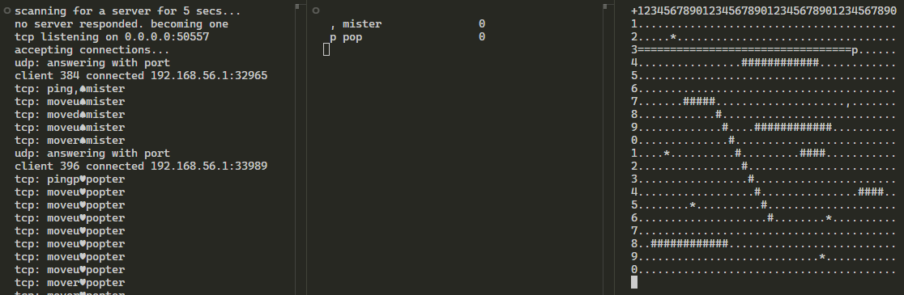

# Sockets Game

## Building

Prerequisites: C++23-compatible compiler, like latest MSVC.

- Open a `.sln` file.
- Build in Visual Studio.

You can also build it in VS Code. Just open the VS Code instance from within Developer Powershell that comes installed with regular VS.

## Running

Run multiple instances of the program.

Use arrow keys to move character.

Use `B` key to detonate a bomb (consumes a diamond).

Use `Home`, `End`, `Page Up`, `Page Down` keys to shoot a beam (consumes a diamond).

Use `Tab` to draw playerboard.

Use `Space` to output log.
